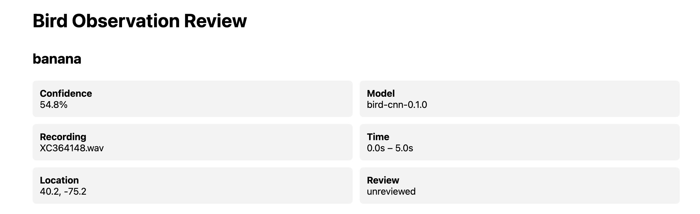
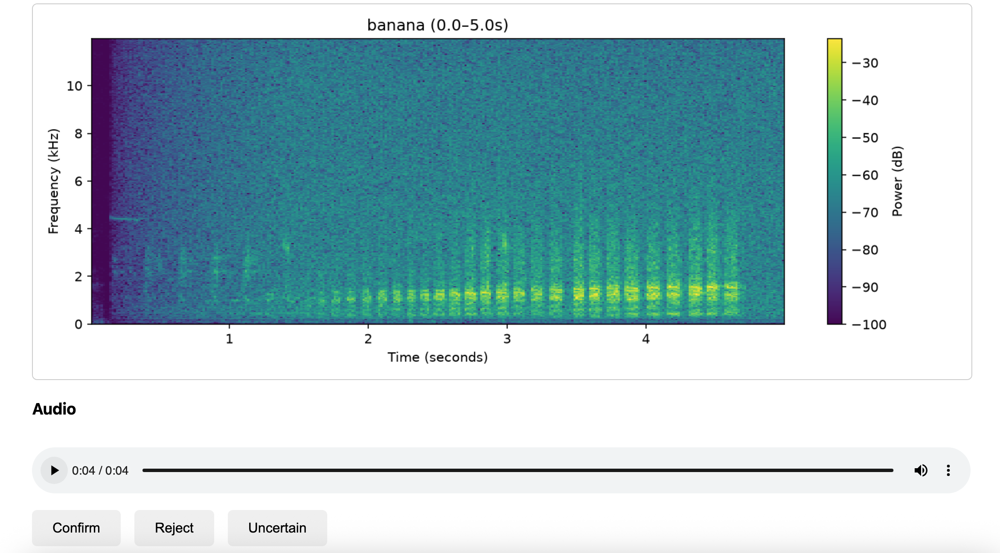

# Bird Acoustic Monitoring

An end-to-end prototype for **passive acoustic biodiversity monitoring**.

The project combines a bird-call ML model with a small production-oriented platform for ingesting recordings, running asynchronous analysis, storing model observations, and putting those predictions through a human review workflow.

## What it does

```text
Recording
    ↓
Recording API
    ↓
Processing Job
    ↓
ML Inference
    ↓
Observation + Model Provenance
    ↓
Human Review
    ↓
Confirmed / Rejected / Uncertain
```

The system currently runs locally using SQLite and filesystem storage, but the API, worker, storage, and inference layers are separated so the components can evolve independently.

### Human review

The browser-based review interface lets a reviewer inspect:

* predicted species
* model confidence
* model version
* recording timestamp and location
* the exact audio segment associated with the prediction
* a generated spectrogram

The reviewer can then mark the prediction **confirmed**, **rejected**, or **uncertain**.

Reviewed observations automatically leave the active review queue.

Model predictions are treated as provisional observations rather than ground truth. The review interface lets a user inspect each prediction alongside the exact audio segment and spectrogram before accepting or rejecting it.




## API

The platform exposes a small REST API:

```text
POST /recordings
    Ingest an audio recording and metadata.

POST /recordings/{id}/process
    Create an asynchronous processing job.

GET /jobs/{id}
    Check processing status.

GET /observations?review_status=unreviewed
    Retrieve observations awaiting human review.

GET /observations/{id}
    Retrieve observation and recording metadata.

GET /observations/{id}/audio
    Retrieve the exact audio segment associated with an observation.

GET /observations/{id}/spectrogram
    Generate a spectrogram for the observation.

POST /observations/{id}/review
    Record a human review decision.
```

This separates the client-facing API from the processing system. ML inference does not run inside the recording-upload request.

## Processing architecture

A separate worker handles processing jobs:

```text
API
 |
 | create job
 v
SQLite
 |
 v
Worker
 |
 +--> load recording
 |
 +--> run inference
 |
 +--> create observations
 |
 +--> store model version
 |
 +--> mark job complete
```

Jobs have explicit lifecycle states:

```text
queued → processing → completed
                  ↘ failed
```

Failures are persisted with the job so that processing errors can be inspected and retried rather than being lost with an HTTP request.

## Model

The current model is a small convolutional neural network trained on a subset of the **BirdCLEF 2026** dataset.

It currently recognizes five species:

* Bananaquit (`banana`)
* Ferruginous Pygmy Owl (`fepowl`)
* House Sparrow (`houspa`)
* Osprey (`osprey`)
* Southern Lapwing (`soulap1`)

The model analyzes 5-second audio windows and produces observations containing:

* predicted species
* confidence
* start/end timestamp
* model version
* review status

The inference implementation is separated from the API and worker so that the model can be replaced without redesigning the surrounding platform.

## Dataset and baseline

The initial experiments use a deterministic subset of BirdCLEF 2026:

* 5 species
* 50 recordings per species
* 250 recordings selected
* 230 recordings at least 5 seconds long
* recording-level train/validation/test split
* 161 training recordings
* 34 validation recordings
* 35 test recordings

Audio is converted to 32 kHz mono and represented as log-power spectrograms using:

* 32 ms Hann window
* 16 ms hop
* frequencies up to 12 kHz
* per-example normalization

The CNN contains approximately 94,000 parameters.

The strongest initial experiment used random temporal cropping:

| Metric             | Result |
| ------------------ | -----: |
| Window accuracy    |  50.8% |
| Window macro F1    |  52.3% |
| Recording accuracy |  54.3% |
| Recording macro F1 |  55.3% |

These results are an early baseline, not a production-quality species identification system.

## Important limitation: closed-set classification

The current classifier must select one of its five known classes even when a recording contains another species.

This means a low-confidence prediction can be more informative than a high-confidence prediction about an incorrect closed-set classification.

The platform therefore treats ML predictions as **hypotheses requiring human validation**, rather than ground truth.

A production system would likely need additional mechanisms such as:

* event detection
* unknown / out-of-distribution detection
* confidence calibration
* overlapping-species handling
* larger and more geographically diverse training data
* domain-expert feedback

## Project structure

```text
bird-acoustic-monitoring/
├── api/
│   ├── database.py
│   ├── main.py
│   ├── models.py
│   ├── run_worker.py
│   ├── schemas.py
│   ├── storage.py
│   ├── worker.py
│   └── static/
│       └── review.html
├── data/
│   └── metadata.csv
├── scripts/
│   ├── download_subset.py
│   ├── evaluate.py
│   ├── find_background_candidates.py
│   ├── inspect_background_candidates.py
│   ├── make_spectrograms.py
│   ├── score_background_candidates.py
│   ├── split_dataset.py
│   └── train.py
├── src/
│   └── bird_monitoring/
│       ├── audio.py
│       ├── dataset.py
│       ├── inference.py
│       └── model.py
├── requirements.txt
└── README.md
```

## Running locally

Install the Python dependencies in a Python 3.12 environment:

```bash
pip install -r requirements.txt
```

Start the API:

```bash
PYTHONPATH=src uvicorn api.main:app --reload
```

API:

```text
http://127.0.0.1:8000
```

Interactive API documentation:

```text
http://127.0.0.1:8000/docs
```

Human review interface:

```text
http://127.0.0.1:8000/review
```

Start the processing worker in a second terminal:

```bash
PYTHONPATH=src python -m api.run_worker
```

## Design decisions

### Keep the infrastructure small

The prototype deliberately uses SQLite, local filesystem storage, and a polling worker rather than introducing distributed infrastructure prematurely.

The goal is to demonstrate the system boundaries and workflow first.

In a production deployment, these interfaces could be backed by PostgreSQL, object storage, and a managed job queue without changing the core observation/review model.

### Separate ML from platform code

The inference layer is intentionally isolated from the API and worker.

This makes it possible to change:

* model architecture
* model weights
* preprocessing
* inference strategy

without coupling those changes to the recording and observation APIs.

### Treat model output as provisional

Observations carry both confidence and model version, and begin in an `unreviewed` state.

This provides an explicit boundary between automated inference and domain-expert validation.

## Future work

The most important next step is moving from fixed-window classification toward **event-based detection**:

```text
Long recording
      ↓
Candidate vocalization detection
      ↓
Species classification
      ↓
Observation
      ↓
Human review
```

Other potential extensions include:

* object storage for recordings and derived artifacts
* PostgreSQL for metadata
* managed asynchronous job queues
* richer model provenance
* geospatial observation queries
* model calibration and monitoring
* reviewer feedback for model evaluation and retraining

## Technology

* Python
* FastAPI
* SQLAlchemy
* SQLite
* PyTorch
* NumPy
* SciPy
* SoundFile
* Matplotlib
* scikit-learn
* BirdCLEF 2026

## Status

**Working prototype.**

The current system demonstrates the complete path from wildlife recording to ML prediction to human-reviewed observation.

The project is intentionally focused on building the smallest useful platform around an ML model rather than optimizing the classifier in isolation.
